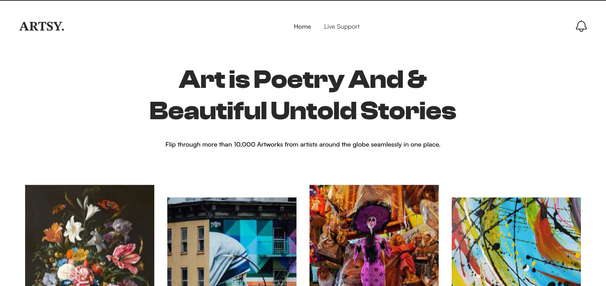

# Arsty - Hackathon project for wemakedevs hakathon

## Table of contents

- [Overview](#overview)
  - [Screenshot](#screenshot)
  - [inspiration](#inspiration)
  - [What](#what-is-does)
  - [Links](#links)
- [My process](#my-process)
  - [Built with](#built-with)
- [Setup](#installation-steps)
- [Author](#author)

## Overview

### Screenshot



### Inspiration

As a person who is more into art, I always wondered why the majority of websites don't have a good UI despite the fact that there are people capable of doing more than that. so I tried to make a website that has a good user experience, look and feel to it.

### what is does

It has a landing page where users can see artwork and when clicking the users are redirected to a new page with detailed info about the artwork beneath that there is a feature for live chat/support where people can start a chat with random people who are also interested in artwork like them and also ask queries if they have any. every time a user enters the chat a new random user is created with a single button click and when the user leaves the website the user is destroyed making the concurrent user free for making space for new users.

### Links

- Live Site URL: [Live Url](https://arthaven.netlify.app/)
- Project submission - [devpost](https://devpost.com/software/artsy-04eoct?ref_content=my-projects-tab&ref_feature=my_projects)

## My process

### Built with

I first started by creating react template by CRA then started making the landing page for the website and making it as clean as I can then I created another page for the art info and added a live chat/support for that page. i went ahead and make the site fully responsive and added animations to it.

## Installation Steps

1. [Fork](https://github.com/ManishBisht777/ChatSupport)

2. Clone the project, you can use the following command:

```bash
git clone https://github.com/<your-github-username>/ChatSupport
```

3. Navigate to the project directory

```bash
cd ChatSupport
```

4. Install dependencies with npm install

```bash
npm install
```

5. Run the project

```bash
npm run start
```

### author

- Website - [manish bisht](https://bisht-dev.netlify.app/)
- Twitter - [@manishbisht](https://twitter.com/manishbisht9711)
